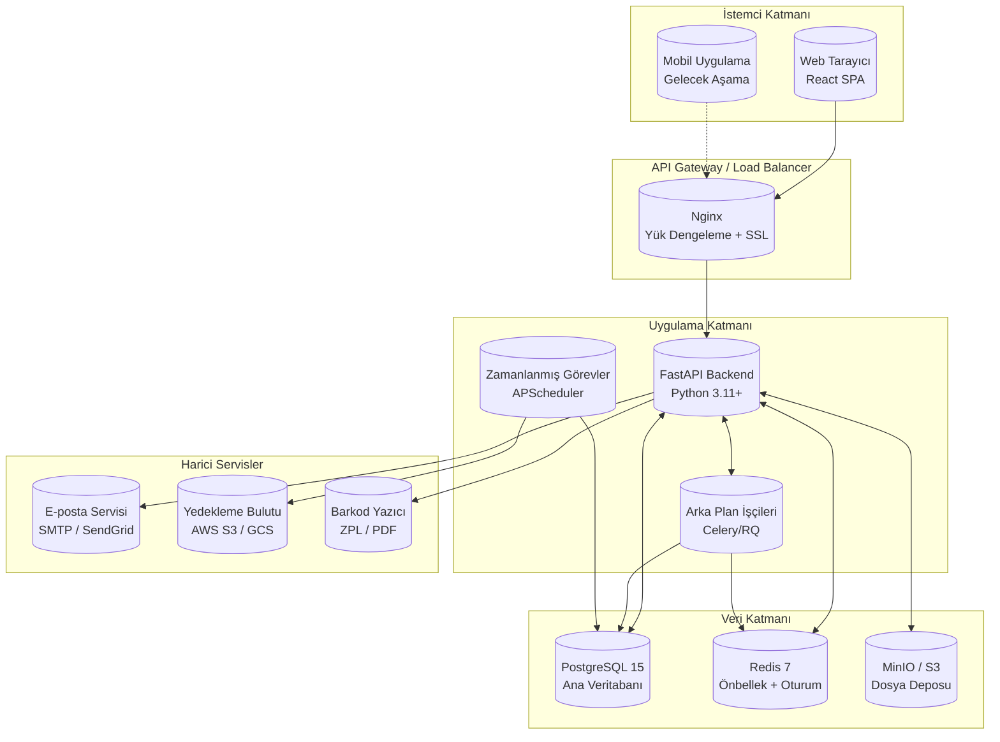
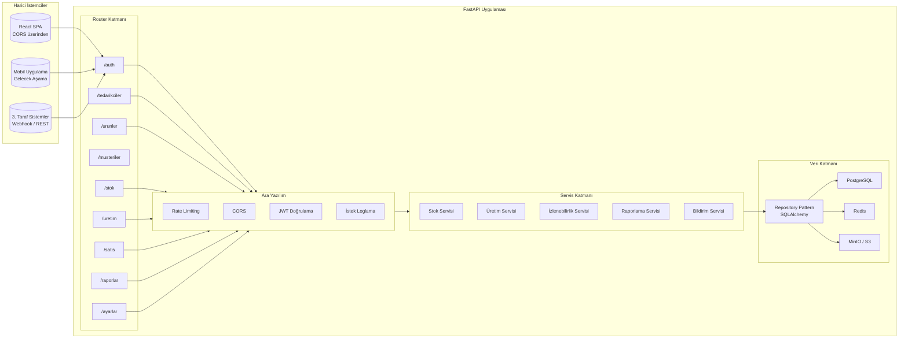
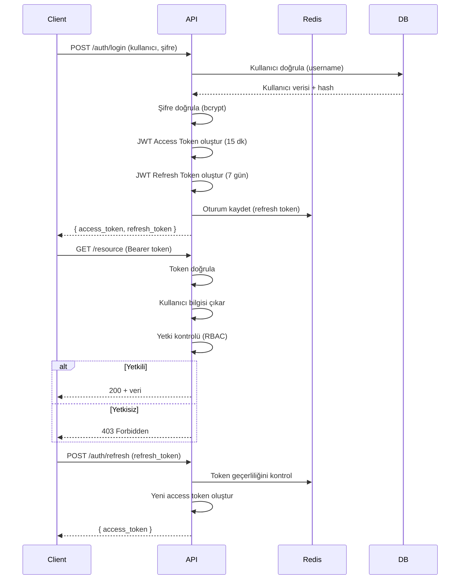
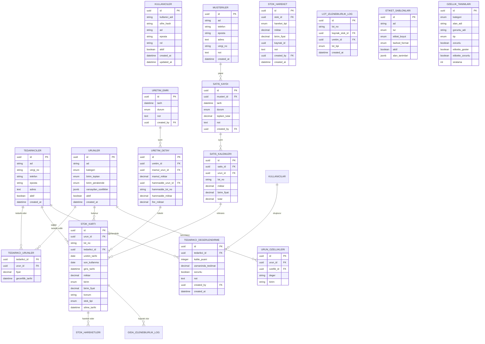
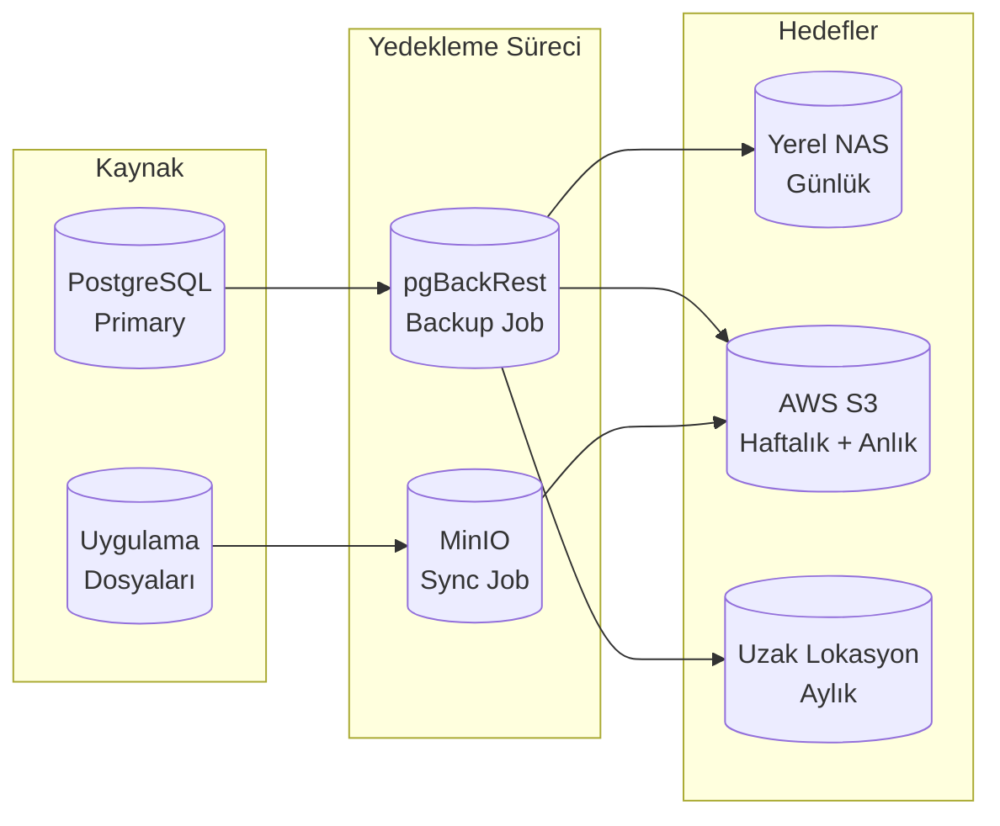
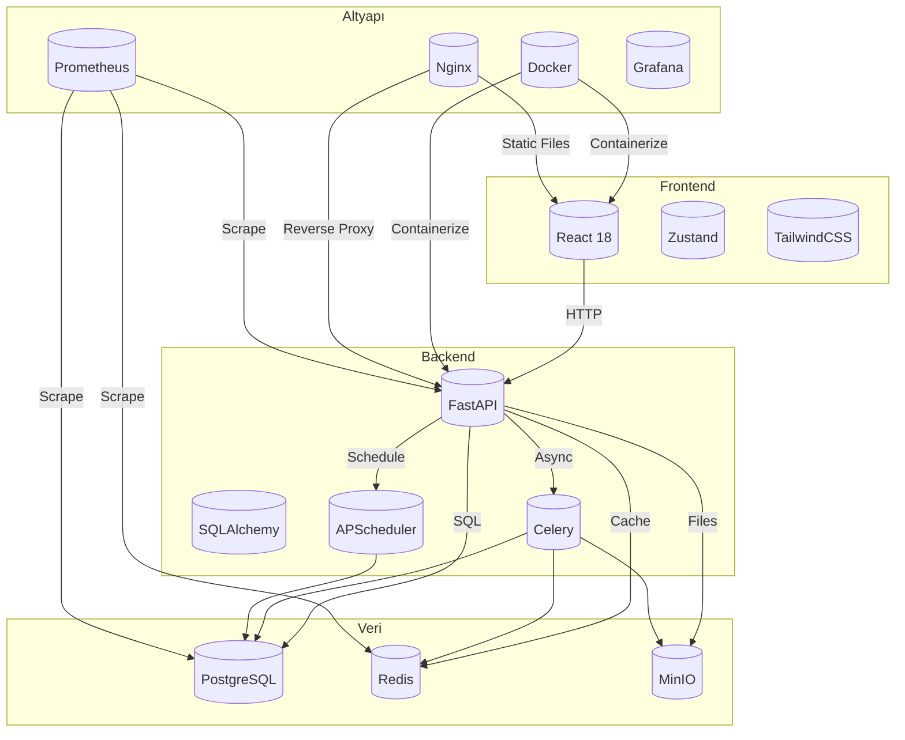
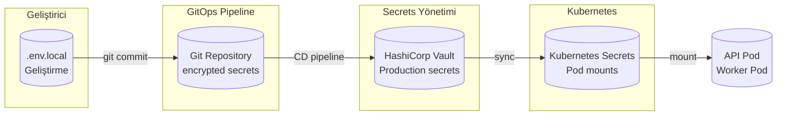

# Sistem Mimarisi Dokümanı
## Kurutulmuş Meyve ve Bal Yönetim Sistemi

---

**Versiyon:** 1.2  
**Tarih:** 2026-07-29  
**Durum:** Tamamlandı

---

## 1. Genel Mimari Bakış

### 1.1 Mimari Özet

Sistem, mikroservis tabanlı değil, modüler bir **monolitik (veya modüler monolit)** mimari üzerine inşa edilmiştir. Bu yaklaşım, ERP sistemlerinin gerektirdiği veri bütünlüğü, işlem bütünlüğü ve ACID uyumluluğunu ön planda tutar. FastAPI (Python) backend ve React frontend kombinasyonuyla geliştirilmektedir.

### 1.2 Yüksek Seviye Mimari Diyagramı



### 1.3 Mimari Kararları

| Karar | Değer | Gerekçe |
|-------|-------|---------|
| Mimari Stil | Modüler Monolit | ERP veri bütünlüğü, ACID, basit deployment |
| API Stili | REST + JSON:API | Yaygın kabul, basit implementasyon |
| Veritabanı | PostgreSQL 15 | ACID uyumluluğu, JSON desteği, güvenilirlik |
| Önbellek | Redis 7 | Oturum yönetimi, performans |
| Dosya Deposu | MinIO / AWS S3 | Ölçeklenebilir nesne depolama |
| Container | Docker + Docker Compose | Geliştirme ve üretim tutarlılığı |
| Orkestrasyon | Kubernetes (gelecek) | Ölçeklenebilirlik, yüksek erişilebilirlik |

---

## 2. Teknoloji Stack'i

### 2.1 Backend

| Bileşen | Teknoloji | Versiyon | Açıklama |
|---------|-----------|----------|----------|
| Runtime | Python | 3.11+ | Ana uygulama dili |
| Framework | FastAPI | 0.104+ | ASGI web framework |
| ORM | SQLAlchemy 2.0 | 2.0+ | Veritabanı soyutlama katmanı |
| Migration | Alembic | 1.12+ | Veritabanı şema yönetimi |
| Validasyon | Pydantic v2 | 2.0+ | Veri doğrulama ve serileştirme |
| Task Queue | Celery | 5.3+ | Asenkron işler, arka plan görevleri |
| Scheduler | APScheduler | 3.10+ | Zamanlanmış görevler |
| Auth | python-jose + passlib | — | JWT token, şifre hashing |
| API Doc | OpenAPI / Swagger | 3.0 | Otomatik API dokümantasyonu |
| Testing | pytest + pytest-asyncio | 7.4+ | Birim testleri |

### 2.2 Frontend

| Bileşen | Teknoloji | Versiyon | Açıklama |
|---------|-----------|----------|----------|
| Framework | React | 18.2+ | UI framework |
| State | Zustand / TanStack Query | 4.x | İstemci state yönetimi |
| Routing | React Router | 6.x | Sayfa yönlendirme |
| UI Library | TailwindCSS + HeadlessUI | 3.x | Bileşen kütüphanesi |
| Form | React Hook Form + Zod | — | Form yönetimi ve validasyon |
| Charts | Recharts / Chart.js | — | Raporlama grafikleri |
| i18n | react-i18next | 13.x | Çoklu dil desteği (Türkçe öncelikli) |
| Testing | Vitest + React Testing Library | — | Bileşen testleri |
| Build | Vite | 5.x | Build aracı |

### 2.3 Veritabanı ve Depolama

| Bileşen | Teknoloji | Açıklama |
|---------|-----------|----------|
| Ana DB | PostgreSQL 15 | İlişkisel veri deposu, ACID |
| Cache | Redis 7 | Oturum, önbellek, rate limiting |
| File Storage | MinIO (yerel) / AWS S3 (üretim) | Fotoğraf, etiket PDF, yedekler |
| Search | PostgreSQL Full-Text Search | Arama işlevselliği |

### 2.4 Altyapı ve DevOps

| Bileşen | Teknoloji | Açıklama |
|---------|-----------|----------|
| Container | Docker 24+ | Uygulama paketleme |
| Compose | Docker Compose v2 | Çoklu konteyner orkestrasyonu |
| Registry | GitHub Container Registry | Docker image barındırma |
| CI/CD | GitHub Actions | Sürekli entegrasyon ve dağıtım |
| Monitoring | Prometheus + Grafana | Metrik toplama ve görselleştirme |
| Logging | ELK Stack (Elasticsearch, Logstash, Kibana) | Merkezi log yönetimi |
| Health | Healthchecks.io / Uptime Kuma | Uptime izleme |
| Secrets | HashiCorp Vault / Docker Secrets | Hassas veri yönetimi |

---

## 3. API Tasarımı

### 3.1 API Mimarisi Genel Görünüm



### 3.2 API Endpoint Yapısı

#### 3.2.1 Kimlik Doğrulama (`/api/v1/auth`)

| Yöntem | Endpoint | Açıklama |
|--------|----------|----------|
| POST | `/login` | Kullanıcı girişi, JWT token döner |
| POST | `/logout` | Oturumu sonlandır |
| POST | `/refresh` | Access token yenile |
| GET | `/me` | Mevcut kullanıcı bilgisi |
| PATCH | `/password` | Şifre değiştir |

**Login Request:**
```json
POST /api/v1/auth/login
{
  "kullanici_adi": "admin",
  "sifre": "****"
}
```

**Login Response:**
```json
{
  "access_token": "eyJhbGciOiJIUzI1NiIs...",
  "refresh_token": "eyJhbGciOiJIUzI1NiIs...",
  "token_type": "bearer",
  "expires_in": 900,
  "user": {
    "id": "uuid",
    "kullanici_adi": "admin",
    "rol": "ADMIN",
    "ad": "Ahmet Yılmaz"
  }
}
```

#### 3.2.2 Tedarikçi Yönetimi (`/api/v1/tedarikciler`)

| Yöntem | Endpoint | Açıklama |
|--------|----------|----------|
| GET | `/` | Tedarikçi listesi (paginate, filtre) |
| POST | `/` | Yeni tedarikçi oluştur |
| GET | `/{id}` | Tedarikçi detayı |
| PUT | `/{id}` | Tedarikçi güncelle |
| DELETE | `/{id}` | Tedarikçi sil (soft delete) |
| GET | `/{id}/performans` | Performans raporu |
| POST | `/{id}/degerlendirme` | Kalite değerlendirmesi ekle |
| GET | `/{id}/urunler` | Tedarikçinin ürünleri |
| POST | `/{id}/urunler` | Tedarikçi-ürün ilişkisi ekle |

#### 3.2.3 Ürün Yönetimi (`/api/v1/urunler`)

| Yöntem | Endpoint | Açıklama |
|--------|----------|----------|
| GET | `/` | Ürün listesi |
| POST | `/` | Yeni ürün oluştur |
| GET | `/{id}` | Ürün detayı |
| PUT | `/{id}` | Ürün güncelle |
| DELETE | `/{id}` | Ürün sil |
| GET | `/{id}/ozellikler` | Ürün özellikleri |
| POST | `/{id}/ozellikler` | Özellik tanımla |
| GET | `/{id}/donusum-orani` | Dönüşüm oranları |
| POST | `/{id}/donusum-orani` | Dönüşüm oranı ekle |
| GET | `/hammaddeler/liste` | Mamul-hammadde seçimi için aktif ve MAMUL olmayan ürünleri listele |

**Ürün sözleşmesi değişiklikleri:** `GET /`, `POST /` ve `PUT /{id}` modelleri `hammadde_id` alanını; okuma modelleri ayrıca `hammadde_ad` alanını destekler. MAMUL kayıtlarında `hammadde_id` zorunludur. İstemci stok kodunu `{KATEGORI_PREFIX}-{URUN_KISALTMASI}-{BOYUT}` biçiminde üretip önizleyebilir; sunucu benzersizlik ve biçim doğrulamasını yapar.

#### 3.2.4 Stok Yönetimi (`/api/v1/stok`)

| Yöntem | Endpoint | Açıklama |
|--------|----------|----------|
| GET | `/` | Stok listesi (filtre, sayfa) |
| POST | `/giris` | Stok girişi (tedarikçiden) |
| POST | `/cikis` | Stok çıkışı (satışa) |
| GET | `/{id}` | Stok kartı detayı |
| GET | `/{id}/hareketler` | Lot hareket geçmişi |
| PATCH | `/{id}` | Stok düzeltme |
| GET | `/skt/lot-onerisi` | FEFO+FIFO hibrit lot önerisi |
| GET | `/uyari` | Minimum stok uyarıları |
| GET | `/skt/rapor` | Son kullanma raporu |

**Stok Girişi Örneği:**
```json
POST /api/v1/stok/giris
{
  "urun_id": "uuid",
  "tedarikci_id": "uuid",
  "lot_no": "OTOMATIK",
  "miktar": 100.0,
  "birim": "kg",
  "birim_fiyat": 150.00,
  "uretim_tarihi": "2026-07-01",
  "son_kullanma": "2027-07-01",
  "konum": "DEPO-A-RAF-3",
  "ozellikler": [
    {"ozellik_id": "uuid", "deger": "Açık sarı"}
  ]
}
```

#### 3.2.5 Üretim Yönetimi (`/api/v1/uretim`)

| Yöntem | Endpoint | Açıklama |
|--------|----------|----------|
| GET | `/` | Üretim emri listesi |
| POST | `/` | Yeni üretim emri oluştur |
| GET | `/{id}` | Üretim emri detayı |
| PUT | `/{id}` | Üretim emri güncelle |
| PATCH | `/{id}/durum` | Durum değiştir |
| POST | `/{id}/tamamla` | Üretimi tamamla, lot oluştur |
| GET | `/{id}/lot` | Oluşan lot bilgisi |
| GET | `/api/v1/raporlar/izlenebilirlik/lot/{lot_no}` | Kanonik lot izlenebilirlik raporu |

**Üretim sözleşmesi ve atomiklik:** `POST /` yanıtında nullable `gerceklesen_miktar` bulunur. `POST /{id}/tamamla` yanıtı `kaynak_lot` bilgisini döndürür. Tamamlama işlemi; hammadde tüketimi, mamul stok oluşturma, `kaynak_stok_id` bağlantısı, kaynak tedarikçinin mamule devri ve üretim lot kaydını tek veritabanı transaction'ında gerçekleştirir. Sayısal miktarlar servis katmanında tutarlı biçimde `Decimal` olarak işlenir; API sınırında serileştirilir.

#### 3.2.6 Satış Yönetimi (`/api/v1/satis`)

| Yöntem | Endpoint | Açıklama |
|--------|----------|----------|
| GET | `/` | Satış listesi |
| POST | `/` | Yeni satış kaydı |
| GET | `/{id}` | Satış detayı |
| PATCH | `/{id}/durum` | Durum güncelle (iptal/iade) |
| GET | `/{id}/lot-kaynak` | Satılan lotların kaynak bilgisi |

**Satış Kaydı:**
```json
POST /api/v1/satis
{
  "musteri_id": "uuid",
  "kalemler": [
    {
      "urun_id": "uuid",
      "miktar": 10.0,
      "birim_fiyat": 250.00
    }
  ],
  "not": "Teslimat kargo ile"
}
```

#### 3.2.7 Raporlama (`/api/v1/raporlar`)

| Yöntem | Endpoint | Açıklama |
|--------|----------|----------|
| GET | `/api/v1/raporlar/stok/anlik` | Anlık stok durumu |
| GET | `/api/v1/raporlar/stok/deger` | Stok değeri raporu |
| GET | `/api/v1/raporlar/satis/ozet` | Satış özeti |
| GET | `/api/v1/raporlar/satis/musteri/{id}` | Müşteri satış geçmişi |
| GET | `/api/v1/raporlar/satis/urun/{id}` | Ürün satış geçmişi |
| GET | `/api/v1/raporlar/tedarikci/performans/{id}` | Tedarikçi performansı |
| GET | `/api/v1/raporlar/uretim/ozet` | Üretim özeti |
| GET | `/api/v1/raporlar/uretim/fire-analiz` | Fire oranı analizi |
| GET | `/api/v1/raporlar/izlenebilirlik/lot/{lot_no}` | Lot izlenebilirlik raporu (kanonik) |

İzlenebilirlik yanıtındaki `kaynak` bölümü tedarikçi bilgisini de içermeli ve arayüzde `TEDARIKCI → HAMMADDE LOT → URETIM → MAMUL LOT` zinciri olarak gösterilmelidir.

#### 3.2.8 Etiket Baskı (`/api/v1/etiket`)

| Yöntem | Endpoint | Açıklama |
|---------|----------|----------|
| GET | `/sablonlar` | Etiket şablonları |
| POST | `/sablonlar` | Şablon oluştur |
| PUT | `/sablonlar/{id}` | Şablon güncelle |
| DELETE | `/sablonlar/{id}` | Şablon sil |
| POST | `/bas` | Etiket baskı (PDF/ZPL) |
| GET | `/onizleme/{sablon_id}` | Önizleme |
| GET | `/lot/{stok_id}` | Lot etiketi oluştur |
| GET | `/urun/{urun_id}` | Ürün etiketi oluştur |

#### 3.2.9 Kalite Kontrol (`/api/v1/kalite-kontrol`)

| Yöntem | Endpoint | Açıklama |
|---------|----------|----------|
| GET | `/` | Kalite kontrol kayıtları (filtrele) |
| POST | `/` | Yeni kalite kontrol kaydı oluştur |
| GET | `/{id}` | Kalite kontrol detayı |
| PUT | `/{id}` | Kalite kontrol güncelle |
| PATCH | `/{id}/durum` | Durum güncelle (KABUL/KISMEN_KABUL/RET) |
| POST | `/{id}/numune` | Numune kaydı ekle |
| GET | `/{id}/numuneler` | Numune listesi |
| POST | `/{id}/onayla` | Onayla (yönetici) |
| POST | `/{id}/reddet` | Reddet (yönetici) |

**Kalite Kontrol Durumları:** BEKLIYOR, KONTROL_EDILIYOR, KABUL, KISMEN_KABUL, RET

#### 3.2.10 Depo Yönetimi (`/api/v1/depo`)

| Yöntem | Endpoint | Açıklama |
|---------|----------|----------|
| GET | `/` | Depo listesi |
| POST | `/` | Yeni depo oluştur |
| GET | `/{id}` | Depo detayı |
| PUT | `/{id}` | Depo güncelle |
| DELETE | `/{id}` | Depo sil (soft delete) |
| GET | `/{id}/doluluk` | Depo doluluk oranı |
| GET | `/{id}/konumlar` | Depo konumları |
| POST | `/{id}/konumlar` | Konum ekle |
| GET | `/konumlar/{id}` | Konum detayı |
| PUT | `/konumlar/{id}` | Konum güncelle |
| GET | `/transferler` | Transfer listesi |
| POST | `/transferler` | Yeni transfer oluştur |
| GET | `/transferler/{id}` | Transfer detayı |
| PATCH | `/transferler/{id}/durum` | Transfer durum güncelle |
| POST | `/transferler/{id}/onayla` | Transfer onayla |
| POST | `/transferler/{id}/reddet` | Transfer reddet |
| POST | `/transferler/{id}/tamamla` | Transfer tamamla (stok hareketi oluştur) |

**Transfer Durumları:** OLUŞTURULDU, BEKLEMEDE, ONAYLANDI, REDDEDILDI, TAMAMLANDI, IPTAL_EDILDI

#### 3.2.11 Bildirim Sistemi (`/api/v1/bildirim`)

| Yöntem | Endpoint | Açıklama |
|---------|----------|----------|
| GET | `/` | Bildirim listesi (kullanıcıya ait) |
| GET | `/{id}` | Bildirim detayı |
| PATCH | `/{id}/okundu` | Okundu işaretle |
| PATCH | `/{id}` | Bildirim güncelle |
| DELETE | `/{id}` | Bildirim sil |
| POST | `/{id}/gonder` | Bildirim gönder (test) |
| GET | `/sablonlar` | Bildirim şablonları |
| POST | `/sablonlar` | Şablon oluştur |
| PUT | `/sablonlar/{id}` | Şablon güncelle |
| DELETE | `/sablonlar/{id}` | Şablon sil |
| GET | `/tercihler` | Kullanıcı bildirim tercihleri |
| PUT | `/tercihler` | Bildirim tercihlerini güncelle |
| GET | `/gonderimler` | Gönderim logları (admin) |

**Bildirim Türleri:** STOK_KRITIK, STOK_DUSUK, LOT_SK_TARIHI, URETIM_FIRE, PLANSIZ_URETIM, TEDARIKCI_PERFORMANS, TEDARIKCI_BEKLEYEN, SISTEM_YEDEKLEME, SISTEM_HATA, VERI_IHLALI, GERI_CAGIRMA, ONAY_BEKLEYEN, KULLANICI_OLUSTU, SIFRE_DEGISIKLIGI, MFA_AKTIF

#### 3.2.12 Birim Dönüşüm (`/api/v1/birim`)

| Yöntem | Endpoint | Açıklama |
|---------|----------|----------|
| GET | `/` | Birim listesi |
| POST | `/` | Yeni birim oluştur |
| GET | `/{id}` | Birim detayı |
| PUT | `/{id}` | Birim güncelle |
| DELETE | `/{id}` | Birim sil |
| GET | `/donusum` | Dönüşüm tablosu |
| POST | `/donusum` | Dönüşüm kuralı ekle |
| GET | `/donusum/{id}` | Dönüşüm detayı |
| PUT | `/donusum/{id}` | Dönüşüm güncelle |
| DELETE | `/donusum/{id}` | Dönüşüm sil |
| POST | `/donusum/hesapla` | Dönüşüm hesapla |

#### 3.2.13 Toplu İşlem (`/api/v1/toplu-islem`)

| Yöntem | Endpoint | Açıklama |
|---------|----------|----------|
| GET | `/` | Toplu işlem listesi |
| POST | `/` | Yeni toplu işlem oluştur (dosya yükle) |
| GET | `/{id}` | İşlem detayı |
| GET | `/{id}/satirlar` | İşlem satırları |
| GET | `/{id}/indir` | Sonuç dosyasını indir |
| POST | `/{id}/onayla` | İşlemi onayla (yönetici) |
| POST | `/{id}/reddet` | İşlemi reddet |
| DELETE | `/{id}` | İşlemi iptal et |

**Toplu İşlem Türleri:** STOK_GIRISI, URETIM_EMRI, MUSKAYIT, TEDARIKCI_KAYIT, STOK_DUZELTME, ETIKET_BASKI, SATIS_IRAC

**İşlem Durumları:** BEKLEMEDE, VALIDATING, ISLENIYOR, TAMAMLANDI, HATALAR_VAR, IPTAL_EDILDI

#### 3.2.14 Üretim Maliyet (`/api/v1/uretim/maliyet`)

| Yöntem | Endpoint | Açıklama |
|---------|----------|----------|
| GET | `/emir/{emir_id}` | Üretim emri maliyet özeti |
| GET | `/emir/{emir_id}/detay` | Maliyet detayları (hammadde/işçilik/enerji) |
| POST | `/emir/{emir_id}/iscilik` | İşçilik kaydı ekle |
| POST | `/emir/{emir_id}/enerji` | Enerji kaydı ekle |
| POST | `/emir/{emir_id}/genel-gider` | Genel gider dağıtımı |
| GET | `/rapor/aylik` | Aylık maliyet raporu |
| GET | `/rapor/urun-bazli` | Ürün bazlı maliyet raporu |

#### 3.2.15 Ürün Özellikleri (`/api/v1/ozellikler`)

| Yöntem | Endpoint | Açıklama |
|---------|----------|----------|
| GET | `/` | Tüm özellik tanımları |
| POST | `/` | Yeni özellik tanımı oluştur |
| GET | `/{id}` | Özellik detayı |
| PUT | `/{id}` | Özellik güncelle |
| DELETE | `/{id}` | Özellik sil (soft delete) |
| GET | `/kategori/{kategori}` | Kategoriye ait özellikler |
| GET | `/kategori/{kategori}/sablon` | Kategori varsayılan şablon |
| POST | `/kategori/{kategori}/seed` | Kategori varsayılan özellikleri oluştur |
| GET | `/lot/{stok_id}` | Lota ait özellik değerleri |
| POST | `/lot/{stok_id}` | Lot özellik değeri ekle |
| PUT | `/lot/{stok_id}/{ozellik_id}` | Lot özellik değeri güncelle |
| DELETE | `/lot/{stok_id}/{ozellik_id}` | Lot özellik değeri sil |
| PUT | `/lot/{stok_id}/toplu` | Lot özelliklerini toplu güncelle |

#### 3.2.16 Satış İade (`/api/v1/satis/{satis_id}/iade`)

| Yöntem | Endpoint | Açıklama |
|---------|----------|----------|
| GET | `/` | İade listesi |
| POST | `/` | Yeni iade kaydı oluştur |
| GET | `/{iade_id}` | İade detayı |
| PUT | `/{iade_id}` | İade güncelle |
| PATCH | `/{iade_id}/durum` | İade durumu güncelle |
| POST | `/{iade_id}/stok-giris` | İade stok girişi yap |
| GET | `/{iade_id}/lot-kaynak` | İade lot kaynak bilgisi |

**İade Durumları:** OLUŞTURULDU, KALITE_KONTROL, STOK_GIRISI, TAMAMLANDI, RET

**İade Nedenleri:** KALITE_SORUNU, YANLIS_URUN, MIKTAR_FARKI, MUSERI_ISTEK, DIGER

#### 3.2.17 SKT Kontrol (`/api/v1/stok/skt`)

SKT endpoint ailesi `/api/v1/stok/skt` namespace'i altında toplanmıştır ve SON-KULLANMA-FEFO-COZUMU §4 ile bire bir uyumludur.

| Yöntem | Endpoint | Açıklama |
|--------|----------|----------|
| GET | `/lot-onerisi` | FEFO+FIFO hibrit lot önerisi (satış/üretim çıkışı öncesi) |
| GET | `/rapor` | SKT durumu raporu (geçen/riskli/normal lotlar) |
| POST | `/islemler` | Geçmiş lot için işlem başlat (imha/indirim/devir) |
| GET | `/islemler/{islem_id}` | İşlem durumu sorgula |
| POST | `/esik` | Ürün bazlı SKT uyarı eşiği tanımla/güncelle |
| GET | `/esik/{urun_id}` | Ürünün aktif SKT eşiğini getir |
| GET | `/lot/{stok_id}` | Tek lot için FEFO bağlamı (kalan gün, öncelik sırası, yüzde) |

#### 3.2.18 Stok Düzeltme Onay (`/api/v1/stok-duzeltme`)

| Yöntem | Endpoint | Açıklama |
|---------|----------|----------|
| GET | `/` | Düzeltme talepleri listesi |
| POST | `/` | Yeni düzeltme talebi oluştur |
| GET | `/{id}` | Düzeltme detayı |
| PATCH | `/{id}/durum` | Durum güncelle |
| POST | `/{id}/onayla` | Düzeltmeyi onayla (yönetici) |
| POST | `/{id}/reddet` | Düzeltmeyi reddet (gerekçe zorunlu) |

**Düzeltme Durumları:** OLUŞTURULDU, BEKLEMEDE_ONAY, ONAYLANDI, REDDEDILDI, STOK_GUNCELLENDI

### 3.3 Ortak Yanıt Yapısı

```json
{
  "success": true,
  "data": { },
  "message": "İşlem başarılı",
  "meta": {
    "page": 1,
    "page_size": 20,
    "total": 150,
    "total_pages": 8
  }
}
```

**Hata Yanıtı:**
```json
{
  "success": false,
  "error": {
    "code": "VALIDATION_ERROR",
    "message": "Girilen değer geçersiz",
    "details": [
      {"field": "miktar", "message": "Miktar sıfırdan büyük olmalıdır"}
    ]
  },
  "request_id": "req-uuid"
}
```

### 3.4 Sayfalandırma

```json
GET /api/v1/tedarikciler?sayfa=1&sayfa_boyutu=20&siralama=ad&yön=asc&arama=elma

Response:
{
  "data": [...],
  "meta": {
    "sayfa": 1,
    "sayfa_boyutu": 20,
    "toplam_kayit": 45,
    "toplam_sayfa": 3
  }
}
```

### 3.5 Rate Limiting

| Endpoint Grubu | Limit | Pencer |
|---------------|-------|--------|
| Auth (login) | 5/dk | Sliding window |
| Okuma (GET) | 100/dk | Sliding window |
| Yazma (POST/PUT/PATCH) | 30/dk | Sliding window |
| Raporlama | 10/dk | Sliding window |

---

## 4. Kimlik Doğrulama ve Yetkilendirme

### 4.1 Kimlik Doğrulama Mimarisi



### 4.2 Rol Tabanlı Erişim Kontrolü (RBAC)

| Rol | Kod | İzinler |
|-----|-----|---------|
| Yönetici | `ADMIN` | Tüm modüllere tam erişim, kullanıcı yönetimi, sistem ayarları |
| Depo Sorumlusu | `DEPO_SORUMLUSU` | Stok giriş/çıkış, üretim, raporlama |
| Satış Sorumlusu | `SATIS_SORUMLUSU` | Müşteri yönetimi, satış, raporlama |
| Rapor Kullanıcısı | `RAPOR` | Salt okunur raporlama |

### 4.3 Endpoint İzin Matrisi

| Modül | Endpoint Ön Eki | ADMIN | DEPO_SORUMLUSU | SATIS_SORUMLUSU | RAPOR |
|-------|----------------|-------|------|--------|-------|
| Tedarikçi | `/tedarikciler` | CRUD | CRUD | — | R |
| Ürün | `/urunler` | CRUD | R | R | R |
| Müşteri | `/musteriler` | CRUD | R | CRUD | R |
| Stok | `/stok` | CRUD | CRUD | R | R |
| Üretim | `/uretim` | CRUD | CRUD | — | R |
| Satış | `/satis` | CRUD | R | CRUD | R |
| Rapor | `/raporlar` | R | R | R | R |
| Ayarlar | `/ayarlar` | CRUD | — | — | — |
| Kullanıcı | `/kullanicilar` | CRUD | — | — | — |

### 4.4 Token Yapısı

**Access Token Payload:**
```json
{
  "sub": "user-uuid",
  "kullanici_adi": "ahmet",
  "rol": "ADMIN",
  "yetkiler": ["tedarikci:crud", "stok:crud", "rapor:r"],
  "iat": 1752000000,
  "exp": 1752000900,
  "jti": "token-uuid"
}
```

### 4.5 Şifre Güvenliği

| Kural | Değer |
|-------|-------|
| Minimum uzunluk | 8 karakter |
| Büyük harf zorunluluğu | En az 1 |
| Küçük harf zorunluluğu | En az 1 |
| Rakam zorunluluğu | En az 1 |
| Özel karakter zorunluluğu | En az 1 |
| Hash algoritması | bcrypt (cost factor 12) |
| Oturum zaman aşımı | 15 dakika hareketsizlik |
| Maksimum oturum | 8 saat |

---

## 5. Veritabanı Mimarisi

### 5.1 ERD Özet Diyagramı



### 5.2 Tablo Açıklamaları

#### 5.2.1 Kritik Tablolar

| Tablo | Açıklama | Büyüklük Tahmini |
|-------|----------|------------------|
| `stok_karti` | Tüm lot/stok kayıtları | Büyük (milyonlarca satır) |
| `stok_hareket` | Stok hareket logları | Çok büyük (milyarlarca satır potansiyeli) |
| `gida_izlenebilirlik_log` | İzlenebilirlik zinciri | Orta |
| `satis_kalemleri` | Satış detayları | Büyük |

### 5.3 İndeks Stratejisi

> Not: Tablolar tekil isimlendirilir (`stok_karti`, `stok_hareket`, `satis_kaydi`, `satis_kalemleri`, `tedarikci_degerlendirme`, `gida_izlenebilirlik_log`); aktiflik soft-delete (`silme_tarihi IS NULL`) ile ifade edilir.

```sql
-- Stok kartı: lot_no ile hızlı arama (aktif satırlarda)
CREATE INDEX idx_stok_lot_no ON stok_karti(lot_no) WHERE silme_tarihi IS NULL;
CREATE INDEX idx_stok_urun_id ON stok_karti(urun_id) WHERE silme_tarihi IS NULL;
CREATE INDEX idx_stok_tedarikci_id ON stok_karti(tedarikci_id) WHERE silme_tarihi IS NULL;
CREATE INDEX idx_stok_son_kullanma ON stok_karti(son_kullanma) WHERE silme_tarihi IS NULL;

-- Stok hareketleri: tarih aralığı sorguları
CREATE INDEX idx_hareket_stok_id ON stok_hareket(stok_id);
CREATE INDEX idx_hareket_tarih ON stok_hareket(created_at);
CREATE INDEX idx_hareket_tip ON stok_hareket(hareket_tipi);

-- Satış: müşteri ve tarih bazlı
CREATE INDEX idx_satis_musteri ON satis_kaydi(musteri_id);
CREATE INDEX idx_satis_tarih ON satis_kaydi(tarih);
CREATE INDEX idx_satis_kalem_stok ON satis_kalemleri(lot_no);

-- Tam metin araması
CREATE INDEX idx_urun_ad_fts ON urunler USING gin(to_tsvector('turkish', ad));
CREATE INDEX idx_tedarikci_ad_fts ON tedarikciler USING gin(to_tsvector('turkish', ad));
```

### 5.4 Veri Bütünlüğü Kuralları

```sql
-- Son kullanma tarihi kontrolü
ALTER TABLE stok_karti ADD CONSTRAINT chk_son_kullanma
  CHECK (son_kullanma > uretim_tarihi);

-- Miktar sıfırdan küçük olamaz
ALTER TABLE stok_karti ADD CONSTRAINT chk_miktar_pozitif
  CHECK (miktar >= 0);

-- Fiyat sıfırdan küçük olamaz
ALTER TABLE stok_karti ADD CONSTRAINT chk_fiyat_pozitif
  CHECK (birim_fiyat >= 0);

-- Foreign key cascade
-- Tedarikçi silindiğinde stok kartı soft delete'e uğrar
-- Ürün silindiğinde stok kartı soft delete'e uğrar
```

---

## 6. Deployment Mimarisi

### 6.1 Ortamlar

| Ortam | Amaç | Domain | Veritabanı |
|-------|------|--------|------------|
| Geliştirme (DEV) | Kod geliştirme | localhost | Yerel PostgreSQL |
| Test (TEST) | Entegrasyon testi | test.kurutulmusmeyve.local | Docker Compose DB |
| Hazırlık (STAGING) | Ön-prod doğrulama | staging.kurutulmusmeyve.com | Ayrı DB instance |
| Üretim (PROD) | Canlı sistem | erp.kurutulmusmeyve.com | Yüksek erişilebilir DB |

### 6.2 Üretim Deployment Mimarisi

```mermaid
flowchart TB
    subgraph Internet["İnternet"]
        Users[("Kullanıcılar"))]
    end

    subgraph CDN["CDN / WAF"]
        CloudFlare[("CloudFlare<br/>SSL + Cache + DDoS"))]
    end

    subgraph LoadBalancer["Yük Dengeleyici"]
        Nginx[("Nginx<br/>VIP + SSL Term.")]
    end

    subgraph Kubernetes["Kubernetes Cluster"]
        subgraph BackendPods["Backend Pods"]
            API1[("API Pod 1"))]
            API2[("API Pod 2"))]
            API3[("API Pod 3"))]
        end

        subgraph WorkerPods["Worker Pods"]
            Worker1[("Celery Worker"))]
            Worker2[("Celery Worker"))]
        end

        subgraph SchedulerPod["Scheduler Pod"]
            Scheduler[("APScheduler<br/>Tek instance"))]
        end

        subgraph FrontendPods["Frontend Pods"]
            Frontend1[("React SPA Pod"))]
            Frontend2[("React SPA Pod"))]
        end

        subgraph SystemPods["Sistem Pods"]
            Redis[("Redis Pod"))]
            MinIO[("MinIO Pod"))]
        end

        Nginx -->|/| Frontend1
        Nginx -->|/api| API1
        Nginx -->|/api| API2
        Nginx -->|/api| API3
    end

    subgraph Database["Veritabanı Katmanı"]
        PostgresPrimary[("PostgreSQL<br/>Primary")]
        PostgresReplica1[("PostgreSQL<br/>Replica 1")]
        PostgresReplica2[("PostgreSQL<br/>Replica 2")]
        BackupVolume[("Backup Storage<br/>S3")]
    end

    API1 <--> PostgresPrimary
    API2 <--> PostgresPrimary
    API3 <--> PostgresPrimary
    PostgresPrimary --> PostgresReplica1
    PostgresPrimary --> PostgresReplica2
    PostgresReplica1 --> BackupVolume
    PostgresReplica2 --> BackupVolume
    API1 --> Redis
    API2 --> Redis
    API3 --> Redis
    API1 --> MinIO
    Workers --> PostgresPrimary
    Workers --> MinIO
```

### 6.3 Docker Yapılandırması

**Dockerfile (Backend):**
```dockerfile
FROM python:3.11-slim

WORKDIR /app

COPY requirements.txt .
RUN pip install --no-cache-dir -r requirements.txt

COPY . .

RUN adduser --disabled-password --gecos '' appuser && \
    chown -R appuser /app

USER appuser

EXPOSE 8000

CMD ["uvicorn", "app.main:app", "--host", "0.0.0.0", "--port", "8000"]
```

**Dockerfile (Frontend):**
```dockerfile
FROM node:20-alpine AS builder

WORKDIR /app
COPY package*.json ./
RUN npm ci
COPY . .
RUN npm run build

FROM nginx:alpine
COPY --from=builder /app/dist /usr/share/nginx/html
COPY nginx.conf /etc/nginx/conf.d/default.conf
EXPOSE 80
CMD ["nginx", "-g", "daemon off;"]
```

**docker-compose.yml (Geliştirme):**
```yaml
version: '3.8'

services:
  api:
    build:
      context: ./backend
      dockerfile: Dockerfile
    ports:
      - "8000:8000"
    environment:
      - DATABASE_URL=postgresql://postgres:postgres@db:5432/erp
      - REDIS_URL=redis://redis:6379/0
      - SECRET_KEY=${SECRET_KEY}
    depends_on:
      - db
      - redis
    volumes:
      - ./backend:/app
    command: uvicorn app.main:app --host 0.0.0.0 --port 8000 --reload

  frontend:
    build:
      context: ./frontend
      dockerfile: Dockerfile.dev
    ports:
      - "3000:3000"
    volumes:
      - ./frontend:/app
      - /app/node_modules
    environment:
      - VITE_API_URL=http://localhost:8000

  db:
    image: postgres:15-alpine
    environment:
      - POSTGRES_DB=erp
      - POSTGRES_USER=postgres
      - POSTGRES_PASSWORD=postgres
    volumes:
      - postgres_data:/var/lib/postgresql/data
      - ./init.sql:/docker-entrypoint-initdb.d/init.sql
    ports:
      - "5432:5432"

  redis:
    image: redis:7-alpine
    ports:
      - "6379:6379"
    volumes:
      - redis_data:/data

  minio:
    image: minio/minio
    ports:
      - "9000:9000"
      - "9001:9001"
    environment:
      - MINIO_ROOT_USER=minioadmin
      - MINIO_ROOT_PASSWORD=minioadmin
    volumes:
      - minio_data:/data
    command: server /data --console-address ":9001"

volumes:
  postgres_data:
  redis_data:
  minio_data:
```

### 6.4 Kubernetes Deployment

**api-deployment.yaml:**
```yaml
apiVersion: apps/v1
kind: Deployment
metadata:
  name: erp-api
  labels:
    app: erp-api
spec:
  replicas: 3
  selector:
    matchLabels:
      app: erp-api
  template:
    metadata:
      labels:
        app: erp-api
    spec:
      containers:
      - name: api
        image: ghcr.io/org/erp-api:latest
        ports:
        - containerPort: 8000
        env:
        - name: DATABASE_URL
          valueFrom:
            secretKeyRef:
              name: erp-secrets
              key: database-url
        - name: REDIS_URL
          valueFrom:
            configMapKeyRef:
              name: erp-config
              key: redis-url
        resources:
          requests:
            memory: "512Mi"
            cpu: "250m"
          limits:
            memory: "1Gi"
            cpu: "500m"
        livenessProbe:
          httpGet:
            path: /health
            port: 8000
          initialDelaySeconds: 30
          periodSeconds: 10
        readinessProbe:
          httpGet:
            path: /health
            port: 8000
          initialDelaySeconds: 5
          periodSeconds: 5
```

---

## 7. CI/CD Pipeline

### 7.1 CI/CD Akış Diyagramı

```mermaid
flowchart LR
    subgraph Commit["Kod Gönderimi"]
        Dev[("Geliştirici<br/>git push"))]
    end

    subgraph CI["CI Pipeline (GitHub Actions)"]
        Checkout["Checkout Kod"]
        Install["Bağımlılık Yükleme"]
        Lint["Lint + Format Kontrol"]
        Test["Birim Testleri"]
        Build["Build Oluşturma"]
        Security["Güvenlik Tarama"]
    end

    subgraph Quality["Kalite Kapıları"]
        Coverage["Test Coverage ≥ 80%"]
        QualityGate["Kod Kalite ≥ B"]
    end

    subgraph CD["CD Pipeline"]
        Registry["Container Registry"]
        Staging["Staging Deploy"]
        Smoke["Smoke Test"]
        Approval["Onay Kapısı"]
        Prod["Prod Deploy"]
    end

    Dev --> Commit
    Commit --> CI
    Checkout --> Install --> Lint --> Test --> Build --> Security
    Security --> Quality
    Quality --> Coverage
    Coverage -->|Geçti| Registry
    Registry --> Staging
    Staging --> Smoke
    Smoke -->|Geçti| Approval
    Smoke -->|Başarısız| Staging
    Approval -->|Onaylandı| Prod
    Approval -->|Reddedildi| Dev
```

### 7.2 GitHub Actions Workflow

**.github/workflows/ci.yml:**
```yaml
name: CI Pipeline

on:
  push:
    branches: [main, develop]
  pull_request:
    branches: [main]

env:
  PYTHON_VERSION: '3.11'
  NODE_VERSION: '20'

jobs:
  backend-ci:
    runs-on: ubuntu-latest
    services:
      postgres:
        image: postgres:15
        env:
          POSTGRES_DB: erp_test
          POSTGRES_USER: postgres
          POSTGRES_PASSWORD: postgres
        ports:
          - 5432:5432
        options: >-
          --health-cmd pg_isready
          --health-interval 10s
          --health-timeout 5s
          --health-retries 5

      redis:
        image: redis:7
        ports:
          - 6379:6379

    steps:
      - uses: actions/checkout@v4

      - name: Setup Python
        uses: actions/setup-python@v5
        with:
          python-version: ${{ env.PYTHON_VERSION }}

      - name: Install dependencies
        run: |
          cd backend
          pip install -r requirements.txt
          pip install pytest pytest-cov pytest-asyncio

      - name: Run linting
        run: |
          cd backend
          ruff check .
          black --check .

      - name: Run tests
        run: |
          cd backend
          pytest --cov=app --cov-report=xml --cov-fail-under=80

      - name: Build Docker image
        run: |
          cd backend
          docker build -t erp-api:${{ github.sha }} .

      - name: Upload coverage
        uses: codecov/codecov-action@v4
        with:
          file: ./backend/coverage.xml

  frontend-ci:
    runs-on: ubuntu-latest
    steps:
      - uses: actions/checkout@v4

      - name: Setup Node
        uses: actions/setup-node@v4
        with:
          node-version: ${{ env.NODE_VERSION }}
          cache: 'npm'
          cache-dependency-path: frontend/package-lock.json

      - name: Install dependencies
        run: |
          cd frontend
          npm ci

      - name: Run linting
        run: |
          cd frontend
          npm run lint

      - name: Run tests
        run: |
          cd frontend
          npm run test -- --coverage --watchAll=false

      - name: Build
        run: |
          cd frontend
          npm run build

      - name: Upload build artifacts
        uses: actions/upload-artifact@v4
        with:
          name: frontend-build
          path: frontend/dist
```

**.github/workflows/cd.yml:**
```yaml
name: CD Pipeline

on:
  push:
    branches: [main]
  workflow_dispatch:

jobs:
  deploy-staging:
    runs-on: ubuntu-latest
    if: github.ref == 'refs/heads/main'
    environment: staging
    steps:
      - name: Checkout
        uses: actions/checkout@v4

      - name: Setup kubectl
        uses: azure/setup-kubectl@v4

      - name: Deploy to Staging
        run: |
          kubectl config use-context staging
          kubectl set image deployment/erp-api api=ghcr.io/org/erp-api:${{ github.sha }}
          kubectl rollout status deployment/erp-api --timeout=300s

      - name: Run smoke tests
        run: |
          curl -f https://staging.kurutulmusmeyve.com/health || exit 1

  deploy-production:
    runs-on: ubuntu-latest
    needs: deploy-staging
    environment: production
    steps:
      - name: Checkout
        uses: actions/checkout@v4

      - name: Deploy to Production
        run: |
          kubectl config use-context production
          kubectl set image deployment/erp-api api=ghcr.io/org/erp-api:${{ github.sha }}
          kubectl rollout status deployment/erp-api --timeout=600s

      - name: Notify
        run: |
          echo "Deployment successful"
```

### 7.3 Otomatik Kontroller

| Kontrol | Araç | Eşik |
|---------|------|------|
| Kod format | Black, Prettier | Sıfır hata |
| Lint | Ruff, ESLint | Sıfır hata |
| Birim test | pytest, Vitest | ≥ 80% coverage |
| Güvenlik tarama | Bandit, npm audit | Sıfır kritik |
| Bağımlılık tarama | Dependabot | Güncel olmalı |
| Konteyner tarama | Trivy | Sıfır kritik bulgu |

---

## 8. İzleme ve Loglama

### 8.1 İzleme Mimarisi

```mermaid
flowchart TB
    subgraph Application["Uygulama"]
        API[("FastAPI API")]
        Worker[("Celery Worker")]
    end

    subgraph Metrics["Metrik Toplama"]
        Prometheus[("Prometheus<br/>Metrik Toplayıcı"))]
        RedisMetrics[("Redis Exporter"))]
        PostgresMetrics[("PostgreSQL Exporter"))]
    end

    subgraph Visualize["Görselleştirme"]
        Grafana[("Grafana<br/>Dashboard"))]
    end

    subgraph Logging["Merkezi Loglama"]
        Fluentd[("Fluentd<br/>Log Toplayıcı")]
        Elasticsearch[("Elasticsearch<br/>Log Deposu")]
        Kibana[("Kibana<br/>Log Arayüzü")]
    end

    subgraph Alerting["Uyarı Sistemi"]
        AlertManager[("Alertmanager<br/>Uyarı Yöneticisi")]
        EmailSlack[("E-posta / Slack")]
    end

    API --> |"Prometheus metrics<br/>/metrics"| Prometheus
    Worker --> |"Prometheus metrics"| Prometheus
    RedisMetrics --> Prometheus
    PostgresMetrics --> Prometheus
    Prometheus --> Grafana
    API --> |"JSON log"| Fluentd
    Worker --> |"JSON log"| Fluentd
    Fluentd --> Elasticsearch
    Elasticsearch --> Kibana
    Prometheus --> |"alert rules"| AlertManager
    AlertManager --> EmailSlack
```

### 8.2 Kritik Metrikler

| Metrik | Açıklama | Hedef | Uyarı |
|--------|----------|-------|-------|
| API Yanıt Süresi (p95) | API endpoint yanıt süresi | < 200ms | > 500ms |
| API Yanıt Süresi (p99) | API endpoint yanıt süresi | < 500ms | > 1s |
| Hata Oranı | 5xx HTTP yanıtları | < 0.1% | > 1% |
| Celery Queue Derinliği | Bekleyen iş sayısı | < 100 | > 500 |
| DB Bağlantı Havuzu | Kullanılan/Toplam | < 70% | > 90% |
| Redis Bellek | Kullanılan bellek | < 70% | > 85% |
| CPU Kullanımı | İşlemci kullanımı | < 60% | > 80% |
| Disk Kullanımı | Disk alanı | < 70% | > 85% |
| Stok Uyarı Sayısı | Kritik stok seviyesi | 0 | > 5 |

### 8.3 Health Check Endpoint'leri

| Endpoint | Açıklama | Dönen Durumlar |
|----------|----------|----------------|
| `GET /health` | Genel sağlık durumu | 200 OK / 503 Service Unavailable |
| `GET /health/live` | Liveness probe (app alive) | 200 OK / 500 |
| `GET /health/ready` | Readiness probe (ready to serve) | 200 OK / 503 |
| `GET /metrics` | Prometheus metrikleri | 200 text/plain |

**Health Response:**
```json
{
  "status": "healthy",
  "version": "1.0.0",
  "checks": {
    "database": { "status": "ok", "latency_ms": 5 },
    "redis": { "status": "ok", "latency_ms": 1 },
    "minio": { "status": "ok", "latency_ms": 20 }
  },
  "uptime_seconds": 86400
}
```

### 8.4 Log Yapısı

```json
{
  "timestamp": "2026-07-27T14:30:00.123Z",
  "level": "INFO",
  "service": "erp-api",
  "trace_id": "abc123",
  "span_id": "def456",
  "user_id": "user-uuid",
  "method": "POST",
  "path": "/api/v1/stok/giris",
  "status_code": 201,
  "duration_ms": 150,
  "request_body": { "urun_id": "uuid", "miktar": 100 },
  "response_body": { "success": true, "data": { "stok_id": "uuid" } },
  "extra": {
    "ip": "192.168.1.1",
    "user_agent": "Mozilla/5.0..."
  }
}
```

### 8.5 Dashboard Panelleri (Grafana)

1. **Genel Bakış Dashboard**
   - Toplam istek sayısı
   - Hata oranı
   - Ortalama yanıt süresi
   - Aktif kullanıcı sayısı

2. **API Performance Dashboard**
   - Endpoint bazlı yanıt süreleri (p50, p95, p99)
   - En yavaş 10 endpoint
   - Rate limit aşımları

3. **Veritabanı Dashboard**
   - Sorgu süreleri
   - Bağlantı havuzu durumu
   - Replikasyon gecikmesi
   - Büyük tablolar

4. **İş Kuyruğı Dashboard**
   - Queue derinliği
   - Tamamlanan işler/saniye
   - Başarısız işler
   - Ortalama iş süresi

---

## 9. Yedekleme ve Felaket Kurtarma

### 9.1 Yedekleme Mimarisi



### 9.2 Yedekleme Stratejisi

| Yedekleme Tipi | Sıklık | Saklama | Konum | Otomasyon |
|----------------|--------|---------|-------|-----------|
| Tam Yedekleme (Full) | Haftalık (Pazar) | 4 hafta | Yerel + S3 | pgBackRest |
| Artımlı (Incremental) | Günlük | 7 gün | Yerel | pgBackRest |
| Anlık ( WAL / Continuous) | Sürekli | 24 saat | S3 | pgBackRest |
| Uygulama Dosyaları | Günlük | 7 gün | S3 | rclone / awscli |
| Yapılandırma | Her değişiklikte | 30 gün | Git + S3 | GitOps |

### 9.3 Yedekleme Betikleri

**pg_backup.sh:**
```bash
#!/bin/bash
set -e

BACKUP_DIR="/backups/postgres"
S3_BUCKET="s3://erp-backups/postgres"
DATE=$(date +%Y%m%d_%H%M%S)
RETENTION_DAYS=7

# Local backup
pg_backrest backup --type=full --stanza=main

# WAL archive to S3
pg_backrest backup --type=incr --stanza=main

# Cleanup old local backups
pg_backrest expire --set=${DATE}

# Sync to S3
aws s3 sync ${BACKUP_DIR} ${S3_BUCKET}/$(date +%Y/%m) --delete

echo "[$(date)] Backup completed: ${DATE}"
```

### 9.4 RPO ve RTO Hedefleri

| Senaryo | RPO (Veri Kaybı) | RTO (Kurtarma Süresi) |
|---------|------------------|----------------------|
| Veritabanı çökmesi | 1 saat (WAL) | 30 dakika |
| Sunucu donanım arızası | 1 saat | 2 saat |
| Veri merkezi kaybı | 24 saat | 4 saat |
| Yanlış veri silme | 1 saat | 1 saat |
| Fidye yazılımı | 24 saat | 48 saat |

### 9.5 Felaket Kurtarma Prosedürü

```mermaid
flowchart TD
    Start[("Olay Tespit")] --> Assess[("Durum Değerlendirmesi")]
    Assess --> |"Veritabanı"| DBRecovery["DB Kurtarma"]
    Assess --> |"Uygulama"| AppRecovery["App Kurtarma"]
    Assess --> |"Tam Kayıp"| FullRecovery["Tam Yeniden Kurulum"]
    
    DBRecovery --> |"Son yedekten"| RestoreBackup["Son Yedekten Dön")]
    DBRecovery --> |"WAL ile"| PointInTime["Belirli Noktaya Dön")]
    
    RestoreBackup --> Verify["Veri Doğrulama"]
    PointInTime --> Verify
    
    AppRecovery --> Redeploy["Yeniden Deploy"]
    FullRecovery --> Provision["Yeni Ortam Hazırla"]
    FullRecovery --> Install["Kurulum + Restore"]
    
    Verify --> TestApp["Fonksiyonel Test"]
    Redeploy --> TestApp
    
    TestApp --> |"Başarılı"| Live["Canlıya Geçiş"]
    TestApp --> |"Başarısız"| Escalate["Eskale"]
    
    Live --> Notify["Bildirim Gönder"]
    Escalate --> Vendor["Satıcı Destek"]
```

### 9.6 Yedekleme Doğrulama

| Test | Sıklık | Açıklama |
|------|--------|----------|
| Restore testi | Aylık | Yedekten gerçek ortama dönüş testi |
| Veri bütünlük kontrolü | Haftalık | Checksum doğrulama |
| RPO/RTO tatbikatı | 6 aylık | Simüle felaket senaryosu |
| Kurtarma prosedürü gözden geçirme | Yıllık | Dokümantasyon güncelleme |

---

## 10. Güvenlik

### 10.1 Güvenlik Mimarisi

```mermaid
flowchart TB
    subgraph Internet["İnternet"]
        Attacker[("Kötü niyetli<br/>Actor"))]
        Users[("Yasal<br/>Kullanıcılar"))]
    end

    subgraph Defense["Savunma Katmanları"]
        WAF[("CloudFlare WAF<br/>DDoS + OWASP")]
        CDN[("CDN<br/>Statik İçerik Cache")]
        SSL[("SSL/TLS<br/>Şifreli İletişim")]
    end

    subgraph Gateway["API Gateway"]
        RateLimit[("Rate Limiting<br/>100 req/dk")]
        Auth[("JWT Doğrulama<br/>Token Kontrol")]
        RBAC[("RBAC<br/>Yetki Kontrolü")]
    end

    subgraph App["Uygulama"]
        InputVal[("Input Validation<br/>Pydantic")]
        Sanitize[("XSS/CSRF<br/>Koruma")]
        Audit[("Audit Log<br/>Tüm İşlemler")]
    end

    subgraph Data["Veri Katmanı"]
        DB[("PostgreSQL<br/>Şifreleme TDE")]
        Secrets[("Vault<br/>Secrets Yönetimi")]
    end

    Attacker --> WAF
    Attacker --x Users
    Users --> WAF
    WAF --> CDN
    CDN --> SSL
    SSL --> RateLimit
    RateLimit --> Auth
    Auth --> RBAC
    RBAC --> InputVal
    InputVal --> Sanitize
    Sanitize --> Audit
    Audit --> DB
    Secrets --> DB
```

### 10.2 Güvenlik Önlemleri Matrisi

| Kategori | Önlem | Implementasyon |
|----------|-------|---------------|
| Ağ Güvenliği | Firewall | CloudFlare WAF, Kubernetes NetworkPolicy |
|  | DDoS Koruma | CloudFlare DDoS protection |
|  | VPN | Production erişimi için |
| Uygulama | Input Validation | Pydantic, Zod |
|  | Output Encoding | HTML escape, JSON encoding |
|  | SQL Injection | ORM (SQLAlchemy) parametreli sorgular |
|  | XSS | Content-Security-Policy header |
|  | CSRF | SameSite cookies, CSRF tokens |
|  | Rate Limiting | Redis tabanlı sliding window |
| Veri | Rest at rest | PostgreSQL TDE, disk şifreleme |
|  | In transit | TLS 1.3 |
|  | Backup encryption | S3 SSE-KMS |
| Kimlik | MFA | TOTP (gelecek aşama) |
|  | Password policy | bcrypt cost=12, karmaşıklık kuralları |
|  | Session timeout | 30 dk hareketsizlik |
| Operasyonel | Secret management | HashiCorp Vault |
|  | Audit logging | Tüm işlemler loglanır |
|  | Güvenlik taramaları | Dependabot, Trivy, Bandit |
|  | Penetrasyon testi | Yıllık |

### 10.3 Şifreleme Standartları

| Veri | Şifreleme | Anahtar Yönetimi |
|------|-----------|------------------|
| Transit (HTTPS) | TLS 1.3 | Otomatik (Let's Encrypt) |
| Veritabanı | AES-256 | PostgreSQL pgcrypto |
| Yedekler | AES-256-KMS | AWS KMS |
| Secrets | Vault Transit | Otomatik rotasyon |
| Kullanıcı şifreleri | bcrypt | — (tek yönlü) |

### 10.4 Audit Log Alanları

```json
{
  "timestamp": "ISO8601",
  "event_type": "STOK_GIRIS | STOK_CIKIS | ...",
  "user_id": "uuid",
  "user_ip": "IP adresi",
  "resource_type": "stok_karti",
  "resource_id": "uuid",
  "action": "CREATE | UPDATE | DELETE",
  "old_value": { },
  "new_value": { },
  "request_id": "uuid",
  "user_agent": "string",
  "result": "SUCCESS | FAILURE",
  "failure_reason": "string (opsiyonel)"
}
```

### 10.5 Güvenlik Başlıkları

```python
# API response headers
headers = {
    "Strict-Transport-Security": "max-age=31536000; includeSubDomains",
    "Content-Security-Policy": "default-src 'self'; script-src 'self'; style-src 'self' 'unsafe-inline'",
    "X-Frame-Options": "DENY",
    "X-Content-Type-Options": "nosniff",
    "X-XSS-Protection": "1; mode=block",
    "Referrer-Policy": "strict-origin-when-cross-origin",
    "Permissions-Policy": "geolocation=(), microphone=(), camera=()"
}
```

---

## 11. Ölçeklenebilirlik

### 11.1 Ölçekleme Stratejisi

```mermaid
flowchart TB
    subgraph Scale["Ölçekleme Katmanları"]
        Direction[("Yatay / Dikey")]
        Auto[("Otomatik Ölçekleme"))]
    end

    subgraph L1["Düzey 1: Uygulama Ölçekleme"]
        HPA1[("API HPA<br/>CPU %70 → 3-10 pod")]
        VPA1[("Celery HPA<br/>Queue > 100 → yeni worker")]
    end

    subgraph L2["Düzey 2: Veritabanı Ölçekleme"]
        ReadReplicas[("Read Replicas<br/>Raporlama → replica")]
        ConnectionPool[("PgBouncer<br/>Connection pooling")]
        Partition[("Table Partitioning<br/>stok_hareket")]	
    end

    subgraph L3["Düzey 3: Depolama Ölçekleme"]
        Sharding[("Veri Parçalama<br/>Tenant-based (gelecek)")]
        Archive[("Arşivleme<br/>Eski veri → S3 Glacier")]
    end

    Direction --> Auto
    Auto --> HPA1
    Auto --> VPA1
    HPA1 --> ReadReplicas
    ReadReplicas --> ConnectionPool
    ConnectionPool --> Partition
    Partition --> Sharding
    Sharding --> Archive
```

### 11.2 Horizontal Pod Autoscaler Kuralları

```yaml
apiVersion: autoscaling/v2
kind: HorizontalPodAutoscaler
metadata:
  name: erp-api-hpa
spec:
  scaleTargetRef:
    apiVersion: apps/v1
    kind: Deployment
    name: erp-api
  minReplicas: 3
  maxReplicas: 10
  metrics:
  - type: Resource
    resource:
      name: cpu
      target:
        type: Utilization
        averageUtilization: 70
  - type: Resource
    resource:
      name: memory
      target:
        type: Utilization
        averageUtilization: 80
  - type: Pods
    pods:
      metric:
        name: http_requests_per_second
      target:
        type: AverageValue
        averageValue: "100"
  behavior:
    scaleUp:
      stabilizationWindowSeconds: 60
      policies:
      - type: Percent
        value: 100
        periodSeconds: 60
    scaleDown:
      stabilizationWindowSeconds: 300
      policies:
      - type: Percent
        value: 10
        periodSeconds: 60
```

### 11.3 Veritabanı Ölçekleme

| Strateji | Uygulama | Eşik |
|----------|----------|------|
| Connection pooling | PgBouncer | 100+ bağlantı |
| Read replica | Raporlama yönlendirme | > 500 QPS |
| Table partitioning | `stok_hareket` (aylık) | > 10M satır |
| Index optimization | Kompozit indeksler | Sorgu planı kötüleşince |
| Query optimization | EXPLAIN ANALYZE | > 100ms sorgular |
| Archive old data | S3 + arşiv tablosu | > 2 yıl |

### 11.4 Performans Hedefleri

| Metrik | Hedef | Kötümser |
|--------|-------|----------|
| API p50 yanıt süresi | < 50ms | < 100ms |
| API p95 yanıt süresi | < 200ms | < 500ms |
| API p99 yanıt süresi | < 500ms | < 1s |
| Sayfa yüklenme (TTFB) | < 1s | < 2s |
| Rapor oluşturma | < 5s | < 10s |
| Eşzamanlı kullanıcı | 100 | 50 |
| Günlük işlem | 10,000 | 5,000 |

### 11.5 Kapasite Planlama

| Bileşen | Minimum | Önerilen | Maksimum |
|---------|---------|----------|----------|
| API Pod (CPU) | 0.5 core | 1 core | 2 core |
| API Pod (RAM) | 512MB | 1GB | 2GB |
| PostgreSQL (CPU) | 2 core | 4 core | 8 core |
| PostgreSQL (RAM) | 4GB | 8GB | 32GB |
| Redis (RAM) | 512MB | 1GB | 4GB |
| Worker (CPU) | 0.5 core | 1 core | 2 core |
| Worker (RAM) | 512MB | 1GB | 2GB |

---

## 12. Sistem Bileşenleri ve Bağımlılıklar

### 12.1 Bağımlılık Matrisi



### 12.2 Environment Variables

```bash
# Backend (.env)
DATABASE_URL=postgresql://postgres:password@db:5432/erp
REDIS_URL=redis://redis:6379/0
SECRET_KEY=<32-byte-random-key>
ALGORITHM=HS256
ACCESS_TOKEN_EXPIRE_MINUTES=30
MINIO_ENDPOINT=minio:9000
MINIO_ACCESS_KEY=minioadmin
MINIO_SECRET_KEY=minioadmin
MINIO_BUCKET=erp-files
SMTP_HOST=smtp.example.com
SMTP_PORT=587
SMTP_USER=notifications@example.com
SMTP_PASSWORD=<secret>
LOG_LEVEL=INFO
ENVIRONMENT=production

# Frontend (.env)
VITE_API_URL=https://api.example.com
VITE_APP_NAME=Kurutulmuş Meyve Bal ERP
VITE_VERSION=1.0.0
```

---

## 13. Mimaride Kullanılan Desenler

### 13.1 Repository Pattern

```python
# Örnek: Stok Repository
class StokRepository:
    def __init__(self, db: Session):
        self.db = db

    def get_by_id(self, stok_id: UUID) -> Optional[StokKartı]:
        return self.db.query(StokKartı).filter(
            StokKartı.id == stok_id,
            StokKartı.aktif == True
        ).first()

    def get_fifo_lot(self, urun_id: UUID, miktar: Decimal) -> List[StokKartı]:
        """FIFO'ya göre uygun lotları döner"""
        return self.db.query(StokKartı).filter(
            StokKartı.urun_id == urun_id,
            StokKartı.miktar > 0,
            StokKartı.aktif == True
        ).order_by(
            StokKartı.giris_tarihi.asc(),
            StokKartı.son_kullanma.asc()
        ).all()
```

### 13.2 Service Layer Pattern

```python
# Örnek: Stok Servisi
class StokService:
    def __init__(self, repo: StokRepository, hareket_repo: StokHareketRepository):
        self.repo = repo
        self.hareket_repo = hareket_repo

    def stok_girisi(self, data: StokGirisSchema, user_id: UUID) -> StokKartı:
        # Validasyon
        tedarikci = self.tedarikci_repo.get_by_id(data.tedarikci_id)
        if not tedarikci:
            raise ValidationError("Tedarikçi bulunamadı")

        # Lot oluştur
        lot_no = self._generate_lot_no(data)

        # Stok kartı oluştur
        stok = StokKartı(
            urun_id=data.urun_id,
            lot_no=lot_no,
            tedarikci_id=data.tedarikci_id,
            miktar=data.miktar,
            birim=data.birim,
            birim_fiyat=data.birim_fiyat,
            uretim_tarihi=data.uretim_tarihi,
            son_kullanma=data.son_kullanma,
            konum=data.konum,
            stok_tipi=StokTipi.HAMMADDE
        )

        # Hareket kaydı oluştur
        hareket = StokHareket(
            stok_id=stok.id,
            hareket_tipi=HareketTipi.GIRIS,
            miktar=data.miktar,
            birim_fiyat=data.birim_fiyat,
            created_by=user_id
        )

        with self.db.transaction():
            self.repo.create(stok)
            self.hareket_repo.create(hareket)

        return stok
```

### 13.3 Event-Driven (Domain Events)

```python
@dataclass
class DomainEvent:
    event_type: str
    occurred_on: datetime
    data: dict

class StokGirisEvent(DomainEvent):
    def __init__(self, stok_id: UUID, urun_id: UUID, miktar: Decimal):
        super().__init__(
            event_type="STOK_GIRIS",
            occurred_on=datetime.utcnow(),
            data={"stok_id": str(stok_id), "urun_id": str(urun_id), "miktar": float(miktar)}
        )

# Event handler (async via Celery)
@celery.task
def handle_stok_giris(event: dict):
    # Bildirim gönder
    # Stok uyarı kontrolü
    # İzlenebilirlik güncelle
    pass
```

---

## 14. Çevre Değişkenleri Yönetimi

### 14.1 Secret Yönetimi Akışı



---

## 15. Tehdit Modeli ve Risk Yönetimi

### 15.1 OWASP Top 10 Mitigasyonları

| Tehdit | Risk | Mitigasyon |
|--------|------|------------|
| A01 Broken Access Control | Yüksek | RBAC + endpoint yetki kontrolü |
| A02 Cryptographic Failures | Yüksek | TLS 1.3 + bcrypt |
| A03 Injection | Yüksek | ORM + input validation |
| A04 Insecure Design | Orta | Threat modeling + code review |
| A05 Security Misconfiguration | Orta | Hardened images + CI/CD scanning |
| A06 Vulnerable Components | Yüksek | Dependabot + Trivy |
| A07 Auth Failures | Yüksek | JWT + session timeout + rate limit |
| A08 Data Integrity | Orta | Audit log + signed backups |
| A09 Logging Failures | Orta | Centralized logging + alerting |
| A10 SSRF | Orta | URL validation + allowlist |

---

## 16. Doküman Geçmişi

| Versiyon | Tarih | Yazar | Değişiklik |
|----------|-------|-------|------------|
| 1.0 | 2026-07-27 | Sistem Mimarisi Ekibi | İlk taslak oluşturuldu |

---

**Sonraki Adımlar:**
1. Bu dokümanın ekip tarafından incelenmesi ve geri bildirim verilmesi
2. Veritabanı tasarım dokümanının hazırlanması
3. Güvenlik değerlendirmesi ve penetration test planı
4. Deployment prosedürlerinin detaylandırılması
5. Disaster recovery planı test tatbikatı
